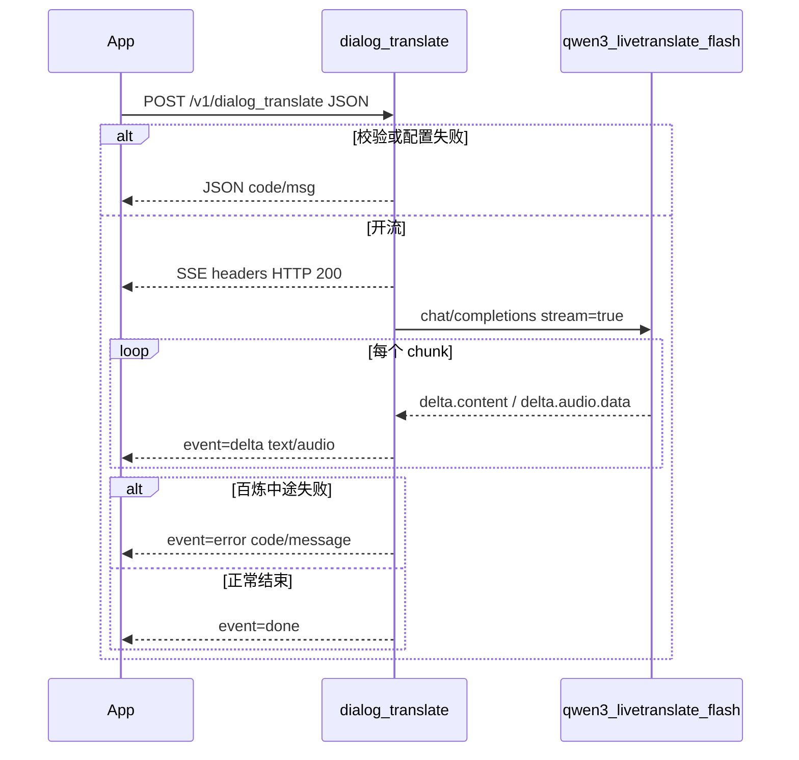

# 对话翻译接入方案

> 状态：代码实施完成，待部署配置与真实环境验收
> 范围：新增 `POST /v1/dialog_translate`，服务端按配置切换引擎（第一期百炼 `qwen3-livetranslate-flash`），SSE 流式回传译文（可选音频）  
> 官方文档：[音视频文件翻译](https://help.aliyun.com/zh/model-studio/qwen3-livetranslate-flash)、[API 参考](https://help.aliyun.com/zh/model-studio/qwen3-livetranslate-flash-api)（控制台 doc `2999748`）

## 现状

同声传译走 `service/volcengine_ast`：

- 路由：`GET /v1/volcengine/ast/credentials`（另有 `/usage`、`/release`）
- 服务端**不下发音频流**，只发凭证；客户端自行连厂商 WebSocket
- 与本需求不同：对话翻译是 **一轮一句的文件翻译**，App 录完一段话后把完整音频交给服务端

现有聊天 SSE（`service/chat/message.go`）已具备 `text/event-stream` 推送和流内 `status=error` 的写法，对话翻译对齐该形态，不复用同传凭证接口。

百炼产品对齐为 [qwen3-livetranslate-flash](https://help.aliyun.com/zh/model-studio/qwen3-livetranslate-flash)：

- HTTP：`POST https://{WorkspaceId}.cn-beijing.maas.aliyuncs.com/compatible-mode/v1/chat/completions`
- **仅支持** OpenAI 兼容流式输出（`stream=true`）
- 输入：一条 `user` 消息，`input_audio` 为公网 URL 或 Base64 Data URL
- 输出：`["text"]` 仅文本；`["text","audio"]` 文本 + Base64 音频

本接口 **不是** 百炼「实时语音/音视频翻译」WebSocket。实时边说边译仍走现有同传链路。

## 决策

| 项 | 决定 |
|----|------|
| 调用形态 | 服务端代理：App 上传音频，服务端调百炼并 SSE 回传 |
| 第一期范围 | 只翻译；**不配额、不落历史、不存原始音频** |
| 持久化 | 不新建表、不建 Store；后续配额单独抽 Store |
| 流式 | 对外 SSE chunk；对内必须 `stream=true` |
| 错误 | 开流前走 `response.Error` JSON；开流后走 SSE `event=error` |
| 语种/大小/音色 | **跟当前引擎走**，不写死在 Handler；**不扩** `model/define/lang.go` |
| 输入字段 `voice` | 按 App 约定表示 **输入音频 Base64**；**输出音色不对外暴露**，由当前引擎适配器选择 |
| 引擎切换 | 服务端配置 `DialogTranslate.Engine` 切换；App **不传** 厂商名。第一期只实现 `bailian`，接口预留 `baidu` |
| 非流式引擎 | 对外仍 SSE；适配器收齐后推 `meta` + 一条 `delta` + `done`，不另开 JSON 出口 |
| 密钥存放 | `env.*.yaml` 的 `DialogTranslate` 段；不写入仓库或硬编码 |

## 流式与错误能否同时支持

**可以。** 百炼该模型本身只提供流式调用；错误分两路，避免「已经 HTTP 200 开流后又想改 status」：

| 时机 | 通道 | 形态 |
|------|------|------|
| 开流前 | 普通 JSON | `{ "code", "msg", "data", "request_id" }`（校验、登录、音频过大、语种不支持） |
| 开流后 | SSE 事件 | `{"event":"error","code":5001,"message":"..."}`（百炼超时、拒识、中途断开） |

客户端必须按 `event` 解析 SSE，不能只看 HTTP 200。百炼原始错误只打日志，不原样丢给 App。

## 数据流



## 对外接口

- 方法/路径：`POST /v1/dialog_translate`（登录组，与同传、聊天一致）
- Content-Type：`application/json`

### 请求

| 字段 | 类型 | 必填 | 示例 | 说明 |
|------|------|:----:|------|------|
| `from` | string | 是 | `en` | 源语种，百炼短码 |
| `to` | string | 是 | `zh` | 目标语种，百炼短码 |
| `voice` | string | 是 | Base64 | 输入音频二进制的 Base64；大小由后端按模型限制校验 |
| `format` | string | 是 | `pcm` | 输入音频格式：`pcm`、`wav` |
| `modalities` | string[] | 是 | `["text"]` | `["text"]` 仅文本；`["text","audio"]` 文本 + Base64 音频 |

`voice` 只表示 App 侧输入音频。百炼文档里的 `voice` 是输出音色，**不作为接口参数**，由后端在调用百炼时写入 `audio.voice`。

### 语种

语种与能否出语音由 **当前引擎** 的 `SupportsLang` / `SupportsAudioOutput` 判断，不写死在 Handler。第一期百炼白名单如下（18 种）；目标语种若只支持文本（`id` / `vi` / `th` / `ar` / `hi` / `el` / `tr`），`modalities` 含 `audio` 时校验直接拒绝。换引擎后以该实现的能力为准。

| 语种代码 | 语种 | 输出模态 |
|----------|------|----------|
| `en` | 英语 | 音频、文本 |
| `zh` | 中文 | 音频、文本 |
| `ru` | 俄语 | 音频、文本 |
| `fr` | 法语 | 音频、文本 |
| `de` | 德语 | 音频、文本 |
| `pt` | 葡萄牙语 | 音频、文本 |
| `es` | 西班牙语 | 音频、文本 |
| `it` | 意大利语 | 音频、文本 |
| `id` | 印尼语 | 文本 |
| `ko` | 韩语 | 音频、文本 |
| `ja` | 日语 | 音频、文本 |
| `vi` | 越南语 | 文本 |
| `th` | 泰语 | 文本 |
| `ar` | 阿拉伯语 | 文本 |
| `yue` | 粤语 | 音频、文本 |
| `hi` | 印地语 | 文本 |
| `el` | 希腊语 | 文本 |
| `tr` | 土耳其语 | 文本 |

`model/define/lang.go` 是 App UI 语言（`zh-Hans` 等），与百炼短码不同，且繁中没有独立目标语种，不得复用或扩写。

### 输入格式

- 第一期接受 `pcm`、`wav`，透传给百炼 `input_audio.format`。
- PCM 约定：16kHz / 16bit / mono。文件翻译官方示例以 `wav` / `mp3` 为主；若联调被拒，优先让 App 改传 `wav`，服务端不做转码。
- 大小跟 **当前引擎** 的 `MaxAudioBytes()`。第一期百炼按官方 Base64 上限（解码后 **7MB**）拒绝；更大文件官方要求改走公网 URL，第一期不支持 URL。
- 解码失败或空音频同样开流前拒绝。Gin / 反向代理 body 建议 ≥ 12MB，避免网关先于业务拦掉合法请求。

### 输出音色（后端选择，不对外）

仅 `modalities` 含 `audio` 时，服务端自己填百炼 `audio.voice`，App 不传。第一期规则：

- 目标语种 `yue` → `Kiki`（官方粤语音色）
- 其余支持音频输出的语种 → `Cherry`

输出音频格式跟模型走，**不写死给 App**。该模型当前官方只允许 `audio.format=wav`，采样率 24kHz；服务端按此请求百炼，并在 SSE 里回传实际 `audio_format` / `sample_rate`，App 用这两个字段解码播放，不要本地写死 wav。若官方日后放开 pcm 等格式，只改服务端请求与回传值。音色映射同样只改服务端，不改 App 入参。

## SSE 事件（开流后）

```text
Content-Type: text/event-stream
Cache-Control: no-cache
Connection: keep-alive
X-Accel-Buffering: no
```

```json
data: {"event":"meta","audio_format":"wav","sample_rate":24000}

data: {"event":"delta","text":"你好","audio":null}

data: {"event":"delta","text":"世界","audio":"<base64 音频片段>","audio_format":"wav","sample_rate":24000}

data: {"event":"done"}

data: {"event":"error","code":5001,"message":"翻译服务暂时不可用，请稍后重试"}
```

| 字段 | 说明 |
|------|------|
| `event=meta` | 仅 `modalities` 含 `audio` 时先推一条。`audio_format` / `sample_rate` 为本次实际输出，方便 App 先初始化播放器 |
| `event=delta` | 增量。`text` 对应百炼 `choices[0].delta.content`；`audio` 对应 `choices[0].delta.audio.data`。带 `audio` 时同时带 `audio_format` / `sample_rate` |
| `event=done` | 正常结束。第一期不回传 token usage |
| `event=error` | 流内唯一错误通道。`code` 复用现有翻译类码（如 `5001`） |

`audio_format` / `sample_rate` 取本次请求百炼的实际值（当前为 `wav` + `24000`），不是 App 入参。纯文本模式不推 `meta`，`delta` 也不带这两个字段。

App 可边收边播音频，或拼完所有 Base64 片段再按回传格式解码。

开流前错误保持现有包络：`{ "code", "msg", "data", "request_id" }`。

### 引擎不支持 SSE 时

**对外协议不变，始终 SSE。** App 不区分当前是哪家模型，也不增加一次 JSON 出口。厂商是否流式只影响适配器怎么 `emit`：

| 引擎能力 | 适配器行为 | App 看到的事件 |
|----------|------------|----------------|
| 原生流式（第一期百炼） | 边收边 `emit` | `meta`（若出语音）+ 多条 `delta` + `done` |
| 只支持一次返回 | 等完整结果再 `emit` | `meta`（若出语音）+ **一条** `delta`（全文 + 完整音频）+ `done` |

非流式引擎的那条 `delta` 字段与流式相同，只是不再拆片：

```json
data: {"event":"meta","audio_format":"wav","sample_rate":24000}

data: {"event":"delta","text":"完整译文","audio":"<完整 Base64>","audio_format":"wav","sample_rate":24000}

data: {"event":"done"}
```

厂商在拿到完整结果前失败：仍走开流前 JSON（尚未 `setupSSE`）或开流后 `event=error`（已经对 App 开流）。不要把厂商原始整包 JSON 透传给 App。

`DialogTranslator` 只保留 `TranslateStream` + `emit`，不另开同步 `Translate()` 给 Handler。非流式实现在适配器内部同步 HTTP，再转成上述 `DialogTranslateChunk`。

## 对内调用：多引擎，不绑死百炼

不复用 `lib/llm`（非流式文本 Chat），也 **不建** `lib/bailian` 让 Handler 直连一家厂商。对齐短信 `Provider`、支付 `PaymentGateway`：能力接口在 `lib/dialog_translate`，各厂商一个实现，配置切换。这是一轮一句的文件翻译，不是实时同传，因此包名不用 `livetranslate`。

```text
Handler（service/dialog_translate）
    ↓ 只依赖 DialogTranslator
lib/dialog_translate.DialogTranslator
    ├── bailian/   第一期
    └── baidu/     预留，本期不实现
```

类型带模块前缀，避免和 `lib/llm` 的 `Translate`、聊天流式 chunk 等同名混淆。

```go
type DialogTranslator interface {
    Name() string
    MaxAudioBytes() int
    SupportsLang(code string) bool
    SupportsAudioOutput(targetLang string) bool
    TranslateStream(ctx context.Context, in DialogTranslateInput, emit func(DialogTranslateChunk) error) error
}

type DialogTranslateInput struct {
    SourceLang string
    TargetLang string
    Audio      []byte // 已解码
    Format     string // pcm / wav
    WantAudio  bool
}

type DialogTranslateChunk struct {
    Event        string // meta / delta / done
    Text         string
    Audio        string // Base64，可空
    AudioFormat  string
    SampleRate   int
}
```

- Handler / `verify.go` 只做 HTTP 形态校验（必填、Base64 能解码、`format`/`modalities` 枚举），**语种是否支持、能否出语音、文件是否超限** 问当前 `DialogTranslator`。
- 音色、厂商协议、是否流式、官方错误码都封在适配器里；SSE 对外仍是统一 `meta/delta/done/error`。非流式引擎收齐后推一条 `delta`，见上节。
- 切换引擎只改 YAML `DialogTranslate.Engine`，initializer 按名字构造实现并 `Setup`。App 无感知。
- 第一期只写 `bailian`；`baidu` 目录可留空或 factory 对未实现引擎返回配置错误。不在本期接百度协议。

### 第一期：百炼适配器

`lib/dialog_translate/bailian` 调 [qwen3-livetranslate-flash](https://help.aliyun.com/zh/model-studio/qwen3-livetranslate-flash-api)：

```http
POST https://{WorkspaceId}.cn-beijing.maas.aliyuncs.com/compatible-mode/v1/chat/completions
Authorization: Bearer <ApiKey>
```

```json
{
  "model": "qwen3-livetranslate-flash",
  "stream": true,
  "messages": [{
    "role": "user",
    "content": [{
      "type": "input_audio",
      "input_audio": {
        "data": "data:audio/wav;base64,...",
        "format": "wav"
      }
    }]
  }],
  "modalities": ["text"],
  "translation_options": {
    "source_lang": "en",
    "target_lang": "zh"
  },
  "audio": {
    "voice": "Cherry",
    "format": "wav"
  }
}
```

- `audio` 仅在 `WantAudio` 时带上；`audio.voice` 由百炼适配器按目标语种选择。
- `MaxAudioBytes()` 返回该模型官方 Base64 上限（当前 7MB 解码后）。
- 超时单独配置（建议 120s）。Gin / 反向代理 body 建议 ≥ 12MB，并关闭响应缓冲。

## 实现步骤

### 1. 配置

在 `config/init.go` 增加引擎选择 + 各厂商配置（密钥仍只进本地 yaml）：

```go
DialogTranslate DialogTranslateConfig `yaml:"DialogTranslate"`

type DialogTranslateConfig struct {
    Engine  string                 `yaml:"Engine"` // bailian；预留 baidu
    Bailian BailianLiveTranslate   `yaml:"Bailian"`
    Baidu   BaiduDialogTranslate   `yaml:"Baidu"` // 本期只占位，不实现客户端
}

type BailianLiveTranslate struct {
    ApiKey         string `yaml:"ApiKey"`
    WorkspaceId    string `yaml:"WorkspaceId"`
    BaseURL        string `yaml:"BaseURL"`
    Model          string `yaml:"Model"`
    TimeoutSeconds int    `yaml:"TimeoutSeconds"`
}
```

### 2. 厂商客户端

`lib/dialog_translate`（不叫 `livetranslate`，以免和百炼实时模型、同传混淆）：

- 根包：`DialogTranslator` 接口、`DialogTranslateInput` / `DialogTranslateChunk`、`NewDialogTranslator(engine, cfg)`
- `bailian/`：组 OpenAI 兼容请求、读 SSE、语种/大小/音色、错误映射
- `baidu/`：本期不实现；factory 遇到 `baidu` 返回明确未实现错误

### 3. 业务包

`service/dialog_translate/`（新功能模板，无 Store）：

- `handler.go`：`validate.Validate` → 映射 `DialogTranslateInput` → `DialogTranslator.TranslateStream` → SSE 转发
- `verify.go`：HTTP 形态校验；语种/出语音/大小调用当前 `DialogTranslator`
- `types.go`：对外 Request / SSE 事件（无厂商字段）
- `Setup(DialogTranslator)`：initializer 注入，Handler 不读全局 YAML、不 import `bailian` 子包

### 4. 路由与装配

- `route/route.go` 登录组注册 `POST /v1/dialog_translate`
- `initializer/initializer.go`：`dialog_translate.NewDialogTranslator(config.Engine, cfg)` 后 `Setup`

### 5. 文档

更新 `docs/main_API.md`：路径、入参、SSE 事件、开流前/开流后错误。

### 6. 不做的事

- 不改同传 `/volcengine/ast/*`、`/simul_trans/*`
- 不做百炼实时 WS 代理
- 不做服务端音频转码
- 不把百炼 Key 下发给 App
- 不把输出音色作为对外参数（`tts_voice` 不出现在请求体）
- 不扩 `model/define/lang.go`
- 不落库、不配额、不保存音频
- 不把密钥提交进 git
- 本期不实现 `baidu` 适配器，只留配置占位和 factory 未实现错误

## 客户端约定

1. 登录后 `POST /v1/dialog_translate`，JSON 上传一段完整音频。
2. 若响应 `Content-Type` 不是 `text/event-stream`，按普通 `{code,msg}` 处理（开流前错误）。
3. SSE 按行解析 `data: {...}`：
   - `event=meta`：用 `audio_format` / `sample_rate` 初始化播放器
   - `event=delta`：追加 `text`；若有 `audio` 则按同事件（或已收到的 meta）里的格式解码播放或缓存拼接
   - `event=done`：本轮结束
   - `event=error`：展示 `message`，结束本轮
4. 输出音频格式以 SSE 回传的 `audio_format` / `sample_rate` 为准，不要本地写死 wav / 24kHz。
5. 不要把 HTTP 200 当成翻译成功。
6. 不要按「有几条 delta」判断引擎；非流式模型也可能只有一条 `delta`，拼 `text`/`audio` 的逻辑与多 chunk 相同。

## 安全提醒

各引擎密钥（百炼 `ApiKey` / `WorkspaceId` 等）只写入本机或部署环境的 `env.*.yaml`，不得提交仓库；若密钥曾暴露，到对应厂商控制台轮换。

## 验收

- 校验失败：普通 JSON 错误，不出现半截 SSE
- `["text"]`：只推 `delta.text`，最终 `done`
- `["text","audio"]`：文本与音频 chunk 可交错；泰语等纯文本语种被校验拦截
- 百炼在开流后失败：收到 `event=error`，进程不崩
- `make check-architecture`
- Handler / verify / 客户端解析单测（用假 SSE，不打真实百炼）
- 有条件时用真实 Key 对一段 `wav` 做冒烟

## 实施清单

- [~] `config/init.go` 已增加 `DialogTranslate`（Engine + Bailian，Baidu 占位）和环境变量密钥覆盖；待部署环境写入真实配置（密钥不进 git）
- [x] 新建 `lib/dialog_translate`：`DialogTranslator` 接口 + `bailian` 实现；`baidu` 不实现。不叫 `livetranslate`（那是实时同传，不是本接口）
- [x] 新建 `service/dialog_translate`：Request 校验、问 `DialogTranslator` 做能力校验、SSE 转发
- [x] `route/route.go` 注册 `POST /v1/dialog_translate`；initializer 按 Engine 注入
- [x] 更新 `docs/main_API.md`
- [x] verify / handler / 客户端解析测试；`make check-architecture`
